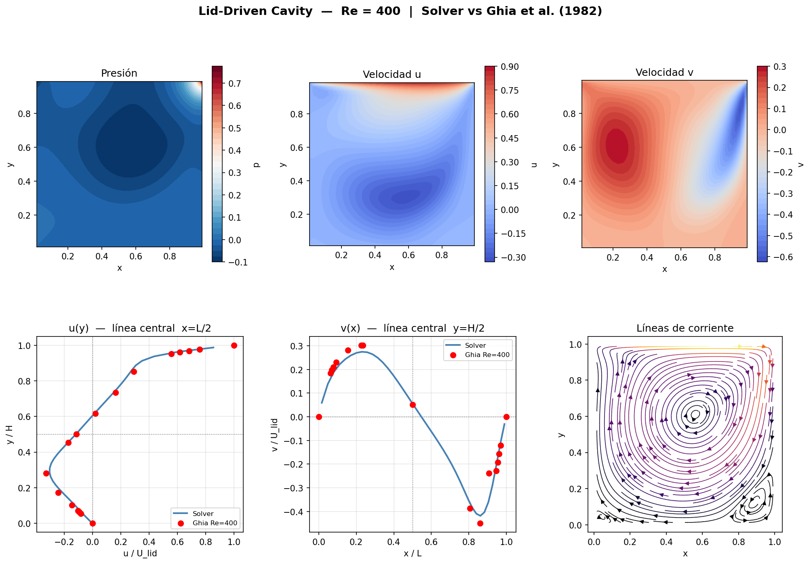
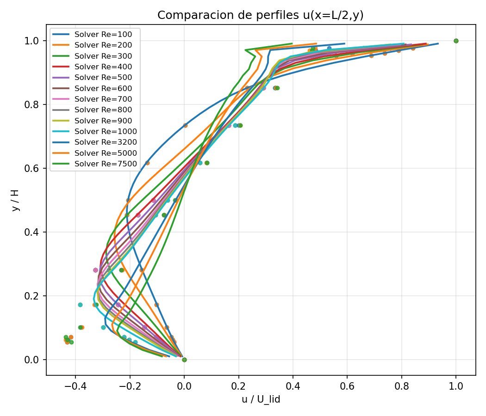
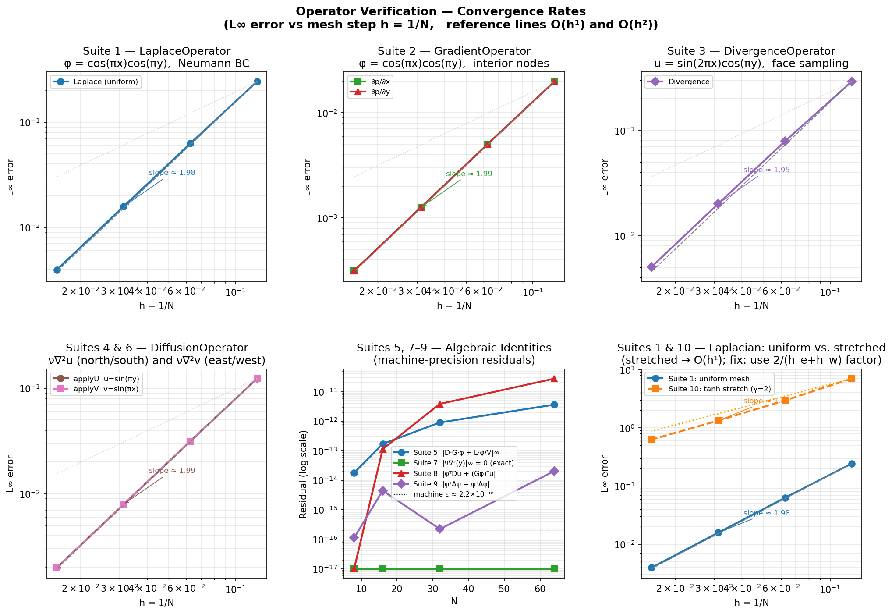

# NavierStokesSolver

A 2D incompressible Navier–Stokes solver built from scratch in C++17, using a
**staggered (MAC) grid** and the **fractional-step (projection) method**.
Validated against two classic CFD benchmarks: the Lid-Driven Cavity (Ghia et
al. 1982) and the Differentially Heated Cavity (de Vahl Davis 1983).



## Features

- **Staggered MAC grid** with independent per-side mesh stretching
  (`sinh`-based refinement) for resolving boundary layers.
- **Fractional-step / projection method** (Chorin): explicit momentum
  predictor + pressure-Poisson correction, enforcing incompressibility
  exactly every step.
- **Warm-started Conjugate Gradient** pressure solver on a symmetric
  positive-definite system assembled via finite volumes.
- **Modular discrete operators** (gradient, divergence, Laplacian,
  diffusion), each independently verified via the Method of Manufactured
  Solutions, with automated convergence-rate reporting.
- **Two validated physical scenarios**, selectable by a single flag:
  - **Lid-Driven Cavity** — momentum + pressure only.
  - **Differentially Heated Cavity** — adds an energy equation and
    Boussinesq buoyancy coupling on top of the same core solver, with zero
    modifications to the momentum/pressure code.
- **Batch sweeps** over Reynolds or Rayleigh numbers in a single run.
- **VTK export** (rectilinear grid) for direct visualization in ParaView.
- **Python post-processing**: centerline-profile validation against
  reference data, Nusselt-number/temperature-field plots, and
  operator convergence-rate plots.

## Project structure

```
.
├── src/                    # C++ solver source
│   ├── mesh/                   mesh generation, stretching, boundary setup
│   ├── operators/               gradient / divergence / Laplacian / diffusion
│   ├── solver/sparse/           CSR matrix + CG/PCG/GS/SOR linear solvers
│   ├── verification/            MMS-based operator convergence checks
│   ├── MomentumSolver.*         predictor step (momentum)
│   ├── PressurePoissonSystem.*  pressure projection step
│   ├── EnergySolver.*           energy equation (DHC scenario only)
│   ├── Buoyancy.hpp             Boussinesq coupling (DHC scenario only)
│   └── main.cpp                 driver: mesh → time loop → VTK/CSV output
├── input/                  # Editable run configuration (geometry, BCs, params)
├── output/                 # Simulation results (VTK, CSV, PNG), per case
├── plotters/               # Python post-processing / validation scripts
├── docs/
│   ├── theory/                  equations, mesh, solver — how it works
│   └── scenarios/               one page per physical problem — how to run it
├── CMakeLists.txt
└── run.sh                  # configure + build + run helper
```

## Requirements

- CMake ≥ 3.15
- A C++17 compiler (g++/clang++)
- Python 3 with `numpy`, `pandas`, `matplotlib`, `scipy` (for the plotting
  scripts in `plotters/`)

## Build & run

```bash
bash run.sh              # configure, build, and run the main solver
bash run.sh build        # configure + build only (all 3 executables)
bash run.sh mesh_gen     # main solver: lid-driven cavity / DHC, per input/sim_params.txt
bash run.sh verify       # operator_verify: MMS convergence check for the operators
bash run.sh sweep        # reynolds_sweep: batch sweep over input/reynolds_cases.txt
```

Or manually:
```bash
cmake -S . -B build_cmake -DCMAKE_BUILD_TYPE=Release
cmake --build build_cmake
./build/mesh_gen          # or operator_verify / reynolds_sweep
```

All three executables must be run **from the repository root**, since
`input/` and `output/` are resolved as relative paths.

## Examples

### 1. Lid-Driven Cavity

```bash
# input/sim_params.txt: solve_energy = 0
bash run.sh mesh_gen
python3 plotters/plot_results.py
```
Validated against Ghia et al. (1982) at $Re = 100$–$10000$. See
[docs/scenarios/lid_driven_cavity.md](docs/scenarios/lid_driven_cavity.md).



### 2. Differentially Heated Cavity

```bash
# input/sim_params.txt: solve_energy = 1
bash run.sh mesh_gen
python3 plotters/plot_dhc.py
```
Validated against de Vahl Davis (1983): $\overline{Nu}\approx 2.31$ at
$Ra=10^4$, matching the reference value (2.243) within a few percent. See
[docs/scenarios/differentially_heated_cavity.md](docs/scenarios/differentially_heated_cavity.md)
— **note the explicit-scheme stability caveat** there before picking a time
step.

### 3. Operator verification / convergence rates

```bash
bash run.sh verify
python3 plotters/plot_convergence.py
```
Produces `output/convergence_rates.png`, confirming 2nd-order accuracy of
the discrete operators on a uniform mesh (see
[docs/theory/solver.md](docs/theory/solver.md) for a documented caveat on
stretched-mesh accuracy).



## Input file reference

All run configuration lives in `input/` as plain text, edited by hand:

| File | Controls |
|---|---|
| `data.txt` | Domain geometry: `L_domain`, `H_domain`, depth, zone corner nodes |
| `stretch.txt` | Cell counts per zone and stretching factors (`beta_*`) |
| `sim_params.txt` | `dt`, `rho`, `U_lid`, `nu`, `max_steps`, `ss_tol`, `solve_energy`, `Pr` |
| `boundaries.txt` | Velocity boundary conditions |
| `boundaries_T.txt` | Temperature boundary conditions (DHC scenario only) |
| `reynolds_cases.txt` | Reynolds numbers to sweep (Lid-Driven Cavity) |
| `rayleigh_cases.txt` | Rayleigh numbers to sweep (Differentially Heated Cavity) |

## Documentation

**Theory** — the physics and numerics, independent of any one scenario:
- [docs/theory/equations.md](docs/theory/equations.md) — governing equations and the fractional-step method
- [docs/theory/mesh.md](docs/theory/mesh.md) — the staggered grid, stretching, boundary setup
- [docs/theory/solver.md](docs/theory/solver.md) — the solver pipeline, class by class

**Scenarios** — the physical problems and how to run them:
- [docs/scenarios/lid_driven_cavity.md](docs/scenarios/lid_driven_cavity.md)
- [docs/scenarios/differentially_heated_cavity.md](docs/scenarios/differentially_heated_cavity.md) (+ [full implementation deep-dive](docs/scenarios/differentially_heated_cavity_EN.md))
- [docs/scenarios/square_cylinder.md](docs/scenarios/square_cylinder.md) — **planned, not yet implemented**

**Legacy** (Spanish, detailed derivations from early development):
[docs/ALGORITMO.md](docs/ALGORITMO.md), [docs/OPERATORS_REPORT.md](docs/OPERATORS_REPORT.md),
[docs/differentially_heated_cavity.md](docs/differentially_heated_cavity.md).

## Validation summary

| Scenario | Reference | Agreement |
|---|---|---|
| Lid-Driven Cavity | Ghia, Ghia & Shin (1982), $Re=100$–$10000$ | centerline $u$/$v$ profiles overlay reference points |
| Differentially Heated Cavity | de Vahl Davis (1983), $Ra=10^3$–$10^6$ | $\overline{Nu}$ within a few percent at $Ra=10^4$ |
| Discrete operators | Method of Manufactured Solutions | ~2nd-order convergence on uniform meshes |

## Future improvements (not yet implemented)

- CLI arguments / a config file selector, instead of hand-editing `input/*.txt` between runs.
- Second-order-accurate Laplacian stencil on stretched meshes (currently 1st-order — see [docs/theory/mesh.md](docs/theory/mesh.md)).
- Square Cylinder scenario (interior/immersed boundary conditions, inlet/outlet flow, drag/lift/Strouhal post-processing) — see [docs/scenarios/square_cylinder.md](docs/scenarios/square_cylinder.md).

## License

[MIT](LICENSE)
